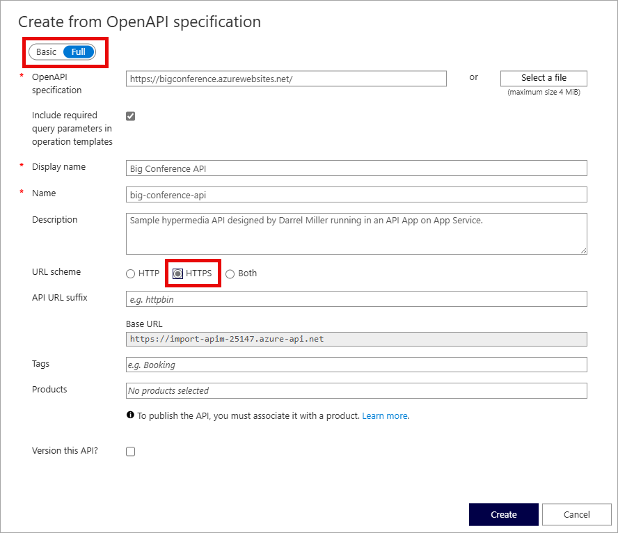

---
lab:
  topic: Azure API Management
  title: Importare e configurare un'API con Gestione API di Azure
  description: 'Informazioni su come importare, pubblicare e testare un''API conforme alla specifica OpenAPI.'
---

# Importare e configurare un'API con Gestione API di Azure

In questo esercizio si crea un'istanza di Gestione API di Azure, si importa un'API back-end basata sulla specifica OpenAPI, si configurano le impostazioni dell'API, inclusi i requisiti dell'URL del servizio Web e della sottoscrizione, e si testano le operazioni dell'API per verificare che funzionino correttamente.

Attività eseguite in questo esercizio:

* Creare un'istanza di Gestione API
* Importare un'API
* Configurare le impostazioni di back-end
* Testare l'API

Questo esercizio richiede circa **20** minuti.

## Creare un'istanza di Gestione API

In questa sezione dell'esercizio si crea un gruppo di risorse e un account di Archiviazione di Azure. Si registrano anche l'endpoint e la chiave di accesso per l'account.

1. Nel browser passare al portale di Azure [https://portal.azure.com](https://portal.azure.com). Accedere con le credenziali di Azure, se richiesto.

1. Usare il pulsante **[\>_]** a destra della barra di ricerca, nella parte superiore della pagina, per aprire una nuova sessione di Cloud Shell nel portale di Azure selezionando un ambiente ***Bash***. Cloud Shell fornisce un'interfaccia della riga di comando in un riquadro nella parte inferiore del portale di Azure. Se viene richiesto di selezionare un account di archiviazione per salvare in modo permanente i file, selezionare **Nessun account di archiviazione richiesto**, selezionare la sottoscrizione e quindi **Applica**.

    > **Nota**: se in precedenza è stata creata una sessione Cloud Shell che usa un ambiente *PowerShell*, passare a ***Bash***.

1. Creare un gruppo di risorse con le risorse necessarie per questo esercizio. Sostituire **myResourceGroup** con un nome da usare per il gruppo di risorse. Se necessario, è possibile sostituire **eastus2** con un'area nelle vicinanze. Se si ha già un gruppo di risorse da usare, procedere con il passaggio successivo.

    ```azurecli
    az group create --location eastus2 --name myResourceGroup
    ```

1. Creare alcune variabili che verranno usate dai comandi dell'interfaccia della riga di comando, in modo da ridurre la quantità di digitazione. Sostituire **<myLocation>** con il valore scelto in precedenza. Il nome di Gestioni API deve essere un nome univoco globale e lo script seguente genera una stringa casuale. Sostituire **<myEmail>** con un indirizzo di posta elettronica a cui è possibile accedere. Sostituire **<myResourceGroup>** con il valore scelto in precedenza.

    ```bash
    myApiName=import-apim-$RANDOM
    myLocation=<myLocation>
    myEmail=<myEmail>
    myResourceGroup=<myResourceGroup>
    ```

1. Creare un'istanza di Gestione API. Il comando **az apim create** viene usato per creare l'istanza. 

    ```bash
    az apim create -n $myApiName \
        --location $myLocation \
        --publisher-email $myEmail  \
        --resource-group $myResourceGroup \
        --publisher-name Import-API-Exercise \
        --sku-name Consumption 
    ```
    > **Nota:** L'operazione deve essere completata in circa cinque minuti. 

## Importare un'API back-end

Questa sezione illustra come importare e pubblicare un'API back-end Specifica OpenAPI.

1. Nel portale di Azure cercare e selezionare **Servizi Gestione API**.

1. Nella schermata **Servizi di Gestione API** selezionare l'istanza di Gestione API creata.

1. Nel riquadro di spostamento del **Servizio Gestione API** selezionare **> API** e quindi selezionare **API**.

    


1. Selezionare **OpenAPI** nella sezione **Crea da definizione** e impostare l'interruttore **Di base/Completa** su **Completa** nel popup visualizzato.

    

    Utilizzare i valori della tabella seguente per compilare il modulo. È possibile lasciare in tutti i campi non indicati il valore predefinito.

    | Impostazione | valore | Descrizione |
    |--|--|--|
    | **Specifica OpenAPI** | `https://petstore3.swagger.io/api/v3/openapi.json` | Fa riferimento al servizio che implementa l'API, le richieste vengono inoltrate a questo indirizzo. La maggior parte delle informazioni necessarie nel modulo viene popolata automaticamente dopo l'immissione di questo valore. |
    | **Schema URL** | Assicurarsi che sia selezionato **HTTPS**. | Definisce il livello di sicurezza del protocollo HTTP accettato dall'API. |

1. Selezionare **Crea**.

## Testare l'API

Ora che l'API è stata importata e configurata è il momento di testarla.

1. Selezionare **Test** nella barra dei menu. Verranno visualizzate tutte le operazioni disponibili nell'API.

1. Cercare e selezionare l'opzione **Find Pets by status**. operazione. 

1. Selezionare **Invia**. Potrebbe essere necessario scorrere verso il basso nella pagina per visualizzare la risposta HTTP.

    Il back-end risponde con **200 OK** e alcuni dati.

1. Per provare risultati diversi, è possibile selezionare uno **stato** diverso nella sezione **Parametri modello**. Selezionare l'elenco a discesa in **VALUE** e scegliere uno stato diverso. Selezionare quindi **Invia** per visualizzare i nuovi risultati.

## Pulire le risorse

Dopo aver completato l'esercizio, è consigliabile eliminare le risorse cloud create per evitare un utilizzo non necessario delle risorse.

1. Nel browser passare al portale di Azure [https://portal.azure.com](https://portal.azure.com). Accedere con le credenziali di Azure, se richiesto.
1. Passare al gruppo di risorse creato e visualizzare il contenuto delle risorse usate in questo esercizio.
1. Sulla barra degli strumenti selezionare **Elimina gruppo di risorse**.
1. Immettere il nome del gruppo di risorse e confermarne l'eliminazione.

> **ATTENZIONE:** Se si elimina un gruppo di risorse, vengono eliminate tutte le risorse contenute in esso. Se si sceglie un gruppo di risorse esistente per questo esercizio, verranno eliminate anche tutte le risorse esistenti esterne all'ambito di questo esercizio.
