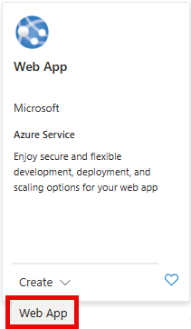

---
lab:
  topic: Azure App Service
  title: Distribuire un'app in contenitori nel Servizio app di Azure
  description: Informazioni su come distribuire un'app in contenitori nel Servizio app di Azure.
---

# Distribuire un'app in contenitori nel Servizio app di Azure

In questo esercizio si crea un'app Web del Servizio app di Azure configurata per l'esecuzione di un'applicazione in contenitori specificando un'immagine del contenitore da Microsoft Container Registry. Si apprenderà come configurare le impostazioni del contenitore, distribuire l'app e verificare che l'applicazione in contenitori venga eseguita correttamente nel Servizio app di Azure.

Attività eseguite in questo esercizio:

* Creare una risorsa del Servizio app di Azure e distribuire un'app in contenitori
* Visualizzare i risultati
* Pulire le risorse

Questo esercizio richiede circa **15** minuti.

## Creare la risorsa app Web

1. Nel browser passare al portale di Azure [https://portal.azure.com](https://portal.azure.com). Accedere con le credenziali di Azure, se richiesto.
1. Selezionare **+ Crea una risorsa** che si trova nell'intestazione **Servizi di Azure** nella parte superiore della home page. 
1. Nella barra di ricerca **Cerca nel marketplace** immettere *app Web* e premere **INVIO** per iniziare la ricerca.
1. Nel riquadro App Web selezionare il menu a discesa **Crea** e quindi selezionare **App Web**.

    

    Selezionando **Crea** verrà aperto un modello con alcune schede da compilare con le informazioni sulla distribuzione. I passaggi seguenti illustrano le modifiche da apportare nelle schede pertinenti.

1. Compilare la scheda **Informazioni di base** con le informazioni riportate nella tabella seguente:

    | Impostazione | Azione |
    |--|--|
    | **Abbonamento** | Mantenere il valore predefinito. |
    | **Gruppo di risorse** | Selezionare Crea nuovo, immettere `rg-WebApp`, quindi scegliere OK. È anche possibile selezionare un gruppo di risorse esistente, se si preferisce. |
    | **Nome** | Immettere un nome univoco, ad esempio **your-initials-containerwebapp**. Sostituire *your-initials* con le proprie iniziali o un altro valore. Il nome deve essere univoco, quindi potrebbe essere necessario apportare alcune modifiche. |
    | Dispositivo di scorrimento sotto l'impostazione **Nome** | Selezionare il dispositivo di scorrimento per disattivarlo. Questo dispositivo di scorrimento viene visualizzato solo in alcune configurazioni di Azure. |
    | **Pubblicazione** | Selezionare l'opzione **Contenitore**. |
    | **Sistema operativo** | Assicurarsi che sia selezionata l'opzione **Linux**. |
    | **Area** | Mantenere la selezione predefinita o scegliere un'area nelle vicinanze. |
    | **Piano Linux** | Mantenere la selezione predefinita. |
    | **Piano tariffario** | Selezionare il menu a discesa e scegliere il piano **F1 gratuito**. |

1. Selezionare o passare alla scheda **Contenitore** e immettere le informazioni riportate nella tabella seguente:

    | Impostazione | Azione |
    |--|--|
    | **Supporto sidecar** | Il dispositivo di scorrimento deve essere impostato sulla posizione **disattivato**. |
    | **Origine immagine** | Selezionare **Altri registri contenitori**. |
    | **Tipo di accesso** | Mantenere la selezione predefinita dell'opzione **Pubblico**. |
    | **URL del server del Registro di sistema** | Immetti `mcr.microsoft.com/k8se`. |
    | **Immagine e tag** | Immetti `quickstart:latest`. |
    | **Comando di avvio** | Lasciare vuoto. |

1. Selezionare la scheda **Rivedi e crea**.
1. Rivedere le selezioni effettuate e quindi selezionare il pulsante **Crea**.

Il completamento della distribuzione richiederà alcuni minuti. Al termine, selezionare il pulsante **Vai alla risorsa**.

Ora che la distribuzione è terminata, è possibile visualizzare l'app Web. Selezionare il collegamento all'app Web accanto al campo **Dominio predefinito** nella sezione **Informazioni di base**. Il collegamento aprirà il sito in una nuova scheda.

>**Nota:** L'esecuzione e la visualizzazione dell'app contenitore distribuita nella nuova scheda potrebbero richiedere alcuni minuti.

## Pulire le risorse

Dopo aver completato l'esercizio, è consigliabile eliminare le risorse cloud create per evitare un utilizzo non necessario delle risorse.

1. Passare al gruppo di risorse creato e visualizzare il contenuto delle risorse usate in questo esercizio.
1. Sulla barra degli strumenti selezionare **Elimina gruppo di risorse**.
1. Immettere il nome del gruppo di risorse e confermarne l'eliminazione.

> **ATTENZIONE:** Se si elimina un gruppo di risorse, vengono eliminate tutte le risorse contenute in esso. Se si sceglie un gruppo di risorse esistente per questo esercizio, verranno eliminate anche tutte le risorse esistenti esterne all'ambito di questo esercizio.
