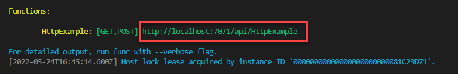
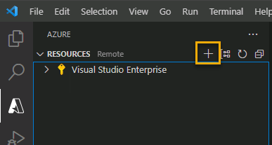
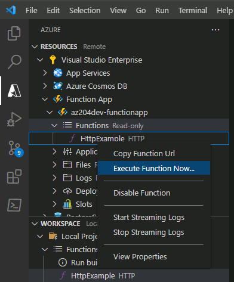

---
lab:
  topic: Azure Functions
  title: Creare una funzione di Azure con Visual Studio Code
  description: 'Informazioni su come creare una funzione di Azure con un trigger HTTP. Dopo aver creato e testato il codice in locale in Visual Studio Code, si eseguirà la distribuzione della funzione in Azure.'
---

# Creare una funzione di Azure con Visual Studio Code

In questo esercizio si apprenderà come creare una funzione C\# che risponde alle richieste HTTP. Dopo aver creato e testato il codice in locale in Visual Studio Code, distribuire e testare la funzione in Azure.

Attività eseguite in questo esercizio:

* Creare il progetto locale
* Eseguire la funzione in locale
* Distribuire ed eseguire la funzione in Azure
* Pulire le risorse

Questo esercizio richiede circa **15** minuti.

## Prima di iniziare

Per completare l'esercizio, è necessario avere:

* Una sottoscrizione di Azure. Se non si dispone ancora di una sottoscrizione, è possibile [registrarsi per ottenere una](https://azure.microsoft.com/).

* [Visual Studio Code](https://code.visualstudio.com/) in una delle [piattaforme supportate](https://code.visualstudio.com/docs/supporting/requirements#_platforms).

* [.NET 8](https://dotnet.microsoft.com/en-us/download/dotnet/8.0) è il framework di destinazione.

* [C# Dev Kit](https://marketplace.visualstudio.com/items?itemName=ms-dotnettools.csdevkit) per Visual Studio Code.

* [Estensione Funzioni di Azure](https://marketplace.visualstudio.com/items?itemName=ms-azuretools.vscode-azurefunctions) per Visual Studio Code.

* Azure Functions Core Tools versione 4.x. Eseguire i comandi seguenti in un terminale per installare Azure Functions Core Tools nel sistema. Per istruzioni sull'installazione su altre piattaforme, vedere [Azure Function Core Tools in GitHub](https://github.com/Azure/azure-functions-core-tools?tab=readme-ov-file#installing).

    ```
    winget uninstall Microsoft.Azure.FunctionsCoreTools
    winget install Microsoft.Azure.FunctionsCoreTools
    ```

    Se si verificano errori durante l'installazione di Azure Function Core Tools, cercare una soluzione in base al codice di errore. Ripetere quindi il comando **winget install** nel passaggio precedente.

## Creare il progetto locale

In questa sezione si userà Visual Studio Code per creare un progetto di Funzioni di Azure locale in C#. Più avanti in questo esercizio il codice della funzione verrà pubblicato in Azure.

1. In Visual Studio Code premere F1 per aprire il riquadro comandi e cercare ed eseguire il comando **Funzioni di Azure: Crea nuovo progetto**.

1. Selezionare la posizione della directory per l'area di lavoro del progetto e quindi scegliere **Seleziona**. È necessario creare una nuova cartella o scegliere una cartella vuota per l'area di lavoro del progetto. Non scegliere una cartella di progetto che fa già parte di un'area di lavoro.

1. Quando richiesto, immettere le informazioni seguenti:

    | Richiesta | Azione |
    |--|--|
    | Selezionare la cartella che conterrà il progetto di funzione | Selezionare **Esplora** per selezionare una cartella per l'app.
    | Selezionare una lingua | Selezionare **C#**. |
    | Selezionare un runtime .NET | Selezionare **.NET 8.0 Isolato** |
    | Selezionare un modello per la prima funzione del progetto | Selezionare **Trigger HTTP**.<sup>1</sup> |
    | Specificare un nome di funzione | Immetti `HttpExample`. |
    | Specificare uno spazio dei nomi | Immetti `My.Function`. |
    | Livello di autorizzazione | Scegliere **Anonimo**, che consente a chiunque di chiamare l'endpoint della funzione. |

    <sup>1</sup> A seconda delle impostazioni di VS Code, potrebbe essere necessario usare l'opzione **Modifica filtro modelli** per visualizzare l'elenco completo dei modelli.

1. Quando viene richiesto di *Selezionare il modo in cui si vuole aprire il progetto* selezionare **Apri nella finestra corrente**.

1. Visual Studio Code usa le informazioni fornite e genera un progetto di Funzioni di Azure con un trigger HTTP. È possibile visualizzare i file di progetto locali in Explorer.

    > **Nota**: Se VS Code visualizza un popup con il titolo **Si considerano attendibili gli autori dei file in questa cartella?**, selezionare il pulsante **Sì, mi fido degli autori**.

### Eseguire la funzione in locale

Visual Studio Code si integra con Azure Functions Core Tools per consentire l'esecuzione di questo progetto nel computer di sviluppo locale prima della pubblicazione in Azure.

1. Assicurarsi che il terminale sia aperto in Visual Studio Code. È possibile aprire il terminale selezionando **Terminale** e quindi **Nuovo terminale** nella barra dei menu. 

1. Premere **F5** per avviare il progetto di app per le funzioni nel debugger. Se viene richiesto di scegliere un account di archiviazione, selezionare **Ignora per adesso**.

    

1. L'output dagli strumenti di base viene visualizzato nel pannello **Terminale**. È possibile visualizzare l'endpoint dell'URL della funzione attivata da HTTP eseguita in locale.

    

1. Con Core Tools in esecuzione, aprire l'estensione **Azure**. Nella sezione **Area di lavoro** dell'estensione espandere **Progetto locale** > **Funzioni**. Fare clic con il pulsante destro del mouse sulla funzione **HttpExample** e selezionare **Esegui funzione adesso**.

    

1. In **Immettere il corpo della richiesta** viene visualizzato il valore del corpo del messaggio di richiesta di `{ "name": "Azure" }`. Premere **INVIO** per inviare il messaggio di richiesta alla funzione. Quando la funzione viene eseguita in locale e restituisce una risposta, viene generata una notifica in Visual Studio Code.

    Selezionare l'icona della campanella di notifica per visualizzare la notifica. Le informazioni sull'esecuzione della funzione sono visualizzate nel riquadro **Terminale**.

1. Premere **MAIUSC + F5** per arrestare Core Tools e disconnettere il debugger.

Dopo aver verificato che la funzione viene eseguita correttamente nel computer locale, è possibile usare Visual Studio Code per pubblicare il progetto direttamente in Azure.

## Distribuire ed eseguire la funzione in Azure

In questa sezione si crea una risorsa dell'app per le funzioni di Azure e si distribuisce la funzione nella risorsa.

### Accedere ad Azure

Prima di potere pubblicare l'app, è necessario accedere ad Azure. Se è già stato eseguito l'accesso, passare alla sezione successiva.

1. Se non è già stato eseguito l'accesso, scegliere l'icona di Azure nella barra Attività e quindi nell'area **Azure: Risorse** scegliere **Accedi ad Azure**.

    

1. Quando viene visualizzata la richiesta nel browser, scegliere l'account Azure e accedere con le credenziali corrispondenti.

1. Dopo avere eseguito l'accesso, è possibile chiudere la nuova finestra del browser. Le sottoscrizioni che appartengono all'account Azure vengono visualizzate nella barra laterale.

### Creare risorse in Azure

In questa sezione vengono create le risorse di Azure necessarie per distribuire l'app per le funzioni locale.

1. Selezionare l'icona di Azure nella barra attività e quindi nell'area **Risorse** selezionare il pulsante **Crea risorsa**.

        

1. Quando richiesto, immettere le informazioni seguenti:

    | Richiesta | Azione |
    |--|--|
    | Selezionare una risorsa da creare | Selezionare **Create Function App in Azure** (Crea un'app per le funzioni in Azure) |
    | Seleziona sottoscrizione | Selezionare la sottoscrizione da usare. *Non verrà visualizzato se si ha una sola sottoscrizione.* |
    | Immettere un nome univoco a livello globale per l'app per le funzioni: | Digitare un nome valido in un percorso URL, ad esempio `myfunctionapp`. Il nome digitato viene convalidato per assicurarsi che sia univoco. |
    | Selezionare una località per le nuove risorse | Per prestazioni ottimali, scegliere un'area vicina. |
    | Selezionare uno stack di runtime | Selezionare **.NET 8.0 Isolato**. |
    | Selezionare il tipo di autenticazione della risorsa | Selezionare **Segreti** |

    L'estensione indica lo stato delle singole risorse durante la creazione nell'area **AZURE** della finestra del terminale.
    
1. Al termine, nella sottoscrizione vengono create le risorse di Azure seguenti con i nomi basati sul nome dell'app per le funzioni:

    * Un gruppo di risorse, ovvero un contenitore logico di risorse correlate.
    * Un account di Archiviazione di Azure standard, che mantiene lo stato e altre informazioni sul progetto.
    * Un piano Consumo Flessibile, che definisce l'host sottostante per l'app per le funzioni serverless.
    * Un'app per le funzioni, che fornisce l'ambiente per l'esecuzione del codice della funzione. Un'app per le funzioni consente di raggruppare le funzioni come un'unità logica per semplificare la gestione, la distribuzione e la condivisione delle risorse all'interno dello stesso piano di hosting.
    * Un'istanza di Application Insights connessa all'app per le funzioni, che tiene traccia dell'utilizzo della funzione serverless.

### Distribuire il progetto in Azure

> **! Importante:** La pubblicazione in una funzione esistente sovrascrive tutte le distribuzioni precedenti.

1. Nel riquadro comandi cercare ed eseguire il comando **Funzioni di Azure: Distribuisci in app per le funzioni**.

1. Selezionare la sottoscrizione usata durante la creazione delle risorse.

1. Selezionare l'app per le funzioni creata. Quando viene richiesto di sovrascrivere le distribuzioni precedenti, selezionare **Distribuisci** per distribuire il codice della funzione nella nuova risorsa dell'app per le funzioni.

1. Al termine della distribuzione, selezionare **Visualizza output** per visualizzare i dettagli dei risultati della distribuzione. Se si perde la notifica, selezionare l'icona della campanella di notifica nell'angolo in basso a destra per visualizzarla di nuovo.

    

### Eseguire la funzione in Azure

1. Tornare all’area **Risorse** nella barra laterale, espandere la sottoscrizione, la nuova app per le funzioni e **Funzioni**. **Fare clic con il pulsante destro del mouse** sulla funzione **HttpExample** e scegliere **Esegui funzione adesso**.

    

1. In **Immettere il corpo della richiesta** viene visualizzato il valore del corpo del messaggio di richiesta di `{ "name": "Azure" }`. Premere **INVIO** per inviare il messaggio di richiesta alla funzione.

1. Quando la funzione viene eseguita in locale e restituisce una risposta, in Visual Studio Code viene generata una notifica. Selezionare l'icona della campanella di notifica per visualizzare la notifica.

## Pulire le risorse

Dopo aver completato l'esercizio, è consigliabile eliminare le risorse cloud create per evitare un utilizzo non necessario delle risorse.

1. Nel browser passare al portale di Azure [https://portal.azure.com](https://portal.azure.com). Accedere con le credenziali di Azure, se richiesto.
1. Passare al gruppo di risorse creato e visualizzare il contenuto delle risorse usate in questo esercizio.
1. Sulla barra degli strumenti selezionare **Elimina gruppo di risorse**.
1. Immettere il nome del gruppo di risorse e confermarne l'eliminazione.

> **ATTENZIONE:** Se si elimina un gruppo di risorse, vengono eliminate tutte le risorse contenute in esso. Se si sceglie un gruppo di risorse esistente per questo esercizio, verranno eliminate anche tutte le risorse esistenti esterne all'ambito di questo esercizio.
